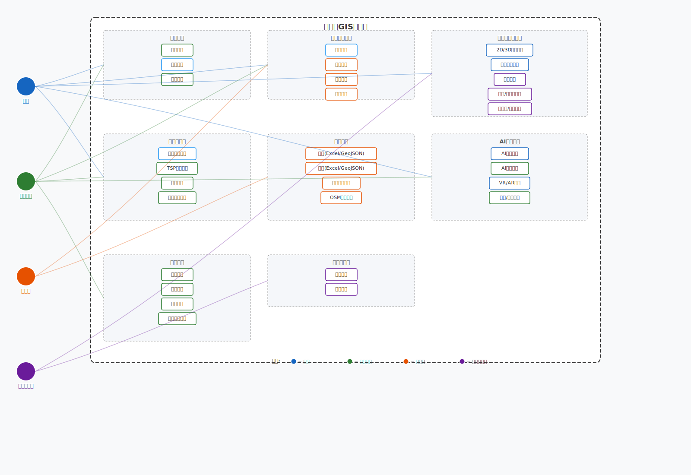

# 滁州亭城GIS系统 需求报告

| 项目名称 | 滁州亭城GIS系统 (TingChengGIS) |
|---------|------------------------------|
| 文档版本 | v1.0.0 |
| 编制日期 | 2026-06-04 |
| 编 制 人 | 需求分析组 |

---

## 一、项目概述

### 1.1 项目背景

滁州因欧阳修《醉翁亭记》而闻名，被誉为"亭城"，拥有醉翁亭、丰乐亭等众多历史名亭。本项目将GIS技术与滁州亭文化结合，打造集文化展示、空间分析、智能服务于一体的综合性地理信息系统。

### 1.2 项目目标

1. **数字化建档**：为滁州228+座亭子建立数字化档案
2. **智能化服务**：提供AI文化讲解、个性化游览推荐
3. **空间化分析**：基于GIS实现距离计算、热力图、TSP最优路线
4. **平台化支撑**：为文旅推广和城市规划提供数据基础

### 1.3 项目意义

- **文化保护**：数字化留存滁州亭文化遗产（文字+影像+空间坐标）
- **文旅融合**：以科技手段提升游客体验，促进地方文旅产业
- **技术示范**：探索GIS + AI + 3S（RS/GIS/GPS）融合应用模式

---

## 二、业务需求

### 2.1 业务角色

| 角色名称 | 角色描述 | 主要操作 |
|---------|---------|---------|
| 游客 | 无需注册的访问者 | 浏览亭子信息、地图展示、查看路线 |
| 注册用户 | 已注册的系统用户 | 收藏、偏好设置、日志记录、分享 |
| 管理员 | 系统管理人员 | 亭子管理、数据导入导出、系统配置 |
| 数据分析员 | 数据管理人员 | 统计分析、数据备份、报表导出 |

### 2.2 核心业务流程

用户角色 | 流程
--------|------
**游客** | `访问 → 浏览地图 → 查看亭子 → 路线查看 → AI讲解体验 → VR/AR体验`
**注册用户** | `注册 → 登录 → 搜索/筛选亭子 → 收藏 → 路线规划(TSP/导航) → 游览日志 → 分享`
**管理员** | `登录 → 导入数据(Excel/GeoJSON) → 编辑审核亭子信息 → 批量坐标纠正 → 发布`
**数据分析员** | `登录 → 空间分析(距离/缓冲区/热力图) → 导出报表 → 数据维护`

---

## 三、系统用例模型

系统共有四类参与角色，覆盖 **31个用例**，按 8 个功能域组织。用例图中，不同颜色表示不同角色的访问权限。

**角色一览**：

| 角色 | 主要功能范围 | 标识色 |
|------|-------------|--------|
| 游客 | 地图浏览、亭子查询、路线查看、AI/VR体验 | 🔵 蓝色 |
| 注册用户 | 登录注册、收藏日志、路线规划、AI建议、分享 | 🟢 绿色 |
| 管理员 | 亭子CRUD、数据导入/导出、坐标纠正、OSM导入 | 🟠 橙色 |
| 数据分析员 | 距离计算、缓冲区查询、热力图生成 | 🟣 紫色 |

**功能域划分**：

| 功能域 | 包含用例数 | 访问角色 |
|--------|-----------|---------|
| 🔐 用户认证 | 3 | 游客、注册用户 |
| 🏛 亭子信息管理 | 4 | 游客、注册用户(查询)、管理员(CRUD) |
| 🗺 地图与空间分析 | 5 | 游客、数据分析员 |
| 📍 路线与导航 | 4 | 游客、注册用户 |
| 📂 数据管理 | 4 | 管理员 |
| 🤖 AI与多媒体 | 4 | 游客、注册用户 |
| ❤️ 社交辅助 | 4 | 注册用户 |
| 📊 统计与报表 | 2 | 数据分析员 |

> 注：用例图使用 UML 用例图规范绘制，椭圆表示用例，虚线框表示系统边界，不同颜色线条和边框标识不同角色的访问范围。

---

## 四、功能需求

### 4.1 🔐 用户认证与授权

| 功能编号 | 功能名称 | 功能描述 | 优先级 |
|---------|---------|---------|-------|
| FR-001 | 用户注册 | 用户可通过用户名、密码、显示名注册账号 | 高 |
| FR-002 | 用户登录 | 已注册用户可登录系统 | 高 |
| FR-003 | 密码修改 | 用户可修改自己的登录密码 | 高 |
| FR-004 | 权限控制 | 区分管理员和普通用户权限 | 高 |
| FR-005 | Token认证 | 使用JWT Token进行身份认证 | 高 |
| FR-006 | 会话管理 | Token过期自动跳转登录 | 中 |

### 4.2 🏛 亭子信息管理

| 功能编号 | 功能名称 | 功能描述 | 优先级 |
|---------|---------|---------|-------|
| FR-010 | 亭子列表查询 | 分页查询亭子列表，支持多条件筛选 | 高 |
| FR-011 | 亭子详情查看 | 查看亭子的完整信息 | 高 |
| FR-012 | 亭子创建 | 管理员可新增亭子信息 | 高 |
| FR-013 | 亭子编辑 | 管理员可修改亭子信息 | 高 |
| FR-014 | 亭子删除 | 管理员可删除亭子信息 | 高 |
| FR-015 | 按类型查询 | 按亭子类型（历史、现代、文化等）筛选 | 中 |
| FR-016 | 按名称搜索 | 按亭子名称关键词搜索 | 中 |
| FR-017 | 按年份筛选 | 按建造年份范围筛选 | 中 |
| FR-018 | 按评分筛选 | 按亭子评分筛选 | 中 |
| FR-019 | 地理范围查询 | 在指定地理范围内查询亭子 | 中 |

### 4.3 📍 千亭综合功能（路线与导航）

| 功能编号 | 功能名称 | 功能描述 | 优先级 |
|---------|---------|---------|-------|
| FR-030 | 亭子位置标注 | 在地图上标注所有亭子位置 | 高 |
| FR-031 | 两亭距离计算 | 计算两个亭子之间的距离 | 高 |
| FR-032 | 遍历路线规划 | 生成遍历所有亭子的最优路线 | 高 |
| FR-033 | 导航方案生成 | 生成详细的导航指引方案 | 高 |
| FR-034 | 逐向导航 | 提供逐向导航指引 | 高 |
| FR-035 | 智能游览规划 | 根据用户时间和偏好推荐游览路线 | 中 |
| FR-036 | 附近设施查询 | 查询亭子周边的配套设施 | 中 |
| FR-037 | 天气信息展示 | 展示当前天气和预报 | 低 |
| FR-038 | 多媒体内容 | 展示亭子的图片、音频、视频等 | 中 |
| FR-039 | 路线分享 | 生成路线分享链接 | 低 |

### 4.4 🗺 空间分析功能

| 功能编号 | 功能名称 | 功能描述 | 优先级 |
|---------|---------|---------|-------|
| FR-040 | 距离计算 | 计算两点或两亭之间的空间距离 | 高 |
| FR-041 | 最近亭子查询 | 查询离指定位置最近的N个亭子 | 高 |
| FR-042 | 缓冲区分析 | 查询指定亭子周边半径范围内的亭子 | 中 |
| FR-043 | 热力图生成 | 生成亭子分布热力图 | 中 |
| FR-044 | 密度分析 | 分析指定区域内亭子分布密度 | 中 |
| FR-045 | 最短路径计算 | 计算两点之间的最短路径 | 中 |
| FR-046 | 最优路径规划 | 基于TSP算法的多点路径优化 | 高 |

### 4.5 📂 数据导入导出

| 功能编号 | 功能名称 | 功能描述 | 优先级 |
|---------|---------|---------|-------|
| FR-050 | Excel导入 | 导入Excel格式的亭子数据 | 高 |
| FR-051 | Excel导出 | 导出亭子数据为Excel格式 | 中 |
| FR-052 | GeoJSON导入 | 导入GeoJSON格式的空间数据 | 中 |
| FR-053 | GeoJSON导出 | 导出空间数据为GeoJSON格式 | 中 |
| FR-054 | CSV导出 | 导出数据为CSV格式 | 低 |
| FR-055 | 导入结果反馈 | 显示导入成功/失败的详细信息 | 高 |

### 4.6 🤖 AI智能服务

| 功能编号 | 功能名称 | 功能描述 | 优先级 |
|---------|---------|---------|-------|
| FR-060 | AI对话 | 与AI进行文化知识问答 | 中 |
| FR-061 | 亭子AI介绍 | 为亭子生成文化介绍内容 | 高 |
| FR-062 | 历史故事生成 | 生成亭子相关的历史故事 | 中 |
| FR-063 | 游览建议生成 | 为用户生成个性化游览建议 | 中 |
| FR-064 | AI服务状态 | 检查AI服务是否可用 | 低 |

### 4.7 🥽 VR/AR体验

| 功能编号 | 功能名称 | 功能描述 | 优先级 |
|---------|---------|---------|-------|
| FR-070 | VR体验 | 提供亭子的VR体验数据 | 低 |
| FR-071 | AR叠加 | 提供亭子的AR叠加数据 | 低 |
| FR-072 | 3D场景 | 提供亭子的3D场景数据 | 低 |

### 4.8 🌍 地图视图功能

| 功能编号 | 功能名称 | 功能描述 | 优先级 |
|---------|---------|---------|-------|
| FR-080 | 2D地图视图 | 基于Leaflet的2D地图展示 | 高 |
| FR-081 | 3D地图视图 | 基于Cesium的3D地球视图 | 中 |
| FR-082 | 2D/3D切换 | 一键切换地图视图模式 | 中 |
| FR-083 | 地图缩放平移 | 支持地图缩放和平移操作 | 高 |
| FR-084 | 图层控制 | 控制地图图层显示/隐藏 | 中 |
| FR-085 | 标记点击交互 | 点击地图标记查看详情 | 高 |
| FR-086 | 路线绘制 | 在地图上绘制导航路线 | 中 |

### 4.9 🚗 交通路线功能

| 功能编号 | 功能名称 | 功能描述 | 优先级 |
|---------|---------|---------|-------|
| FR-090 | 交通路线查询 | 查询亭子间的交通路线 | 中 |
| FR-091 | 交通方式选择 | 支持步行、驾车等多种交通方式 | 中 |
| FR-092 | 路网构建 | 管理员可构建交通路网 | 高 |
| FR-093 | 多模式路网 | 支持多模式交通网络 | 低 |

### 4.10 🔧 辅助功能

| 功能编号 | 功能名称 | 功能描述 | 优先级 |
|---------|---------|---------|-------|
| FR-100 | 图片上传 | 支持亭子图片上传 | 中 |
| FR-101 | 坐标转换 | 支持WGS-84与GCJ-02坐标转换 | 高 |
| FR-102 | 批量坐标纠正 | 管理员可批量纠正坐标数据 | 中 |
| FR-103 | OGC服务 | 支持WMS/WFS标准服务 | 低 |
| FR-104 | OSM数据导入 | 导入OpenStreetMap数据 | 低 |

---

## 五、⚡ 非功能需求

### 5.1 性能需求

| 指标项 | 要求值 | 说明 |
|-------|-------|------|
| 首页加载时间 | < 3秒 | 从请求到完整渲染时间 |
| API响应时间 | < 500ms | 普通查询接口响应 |
| 复杂查询响应 | < 2秒 | 空间分析、路径计算等 |
| 并发用户数 | ≥ 50 | 系统同时支持的用户数 |
| 大数据量性能 | 1000+亭子 | 数据量大时性能稳定 |
| 内存使用 | 无泄漏 | 长时间运行无内存泄漏 |

### 5.2 安全需求

| 安全项 | 要求 | 实现方式 |
|-------|------|---------|
| 密码存储 | 加密存储 | BCrypt算法 |
| 认证安全 | Token认证 | JWT Token |
| 授权控制 | 权限分离 | @PreAuthorize注解 |
| SQL注入防护 | 禁止注入 | JPA参数化查询 |
| XSS防护 | 防止脚本攻击 | 模板自动转义 |
| CSRF防护 | 跨站请求伪造 | Spring Security配置 |
| 错误信息保护 | 不泄露技术细节 | 统一异常处理 |
| 敏感数据保护 | 不记录密码 | 日志脱敏 |
| HTTPS传输 | 生产环境强制 | SSL/TLS加密 |

### 5.3 可用性需求

| 可用性指标 | 要求值 |
|-----------|-------|
| 系统可用性 | ≥ 99.5% |
| 故障恢复时间 | < 30分钟 |
| 数据备份频率 | 每日备份 |
| 响应时间可用性 | ≥ 99% |

### 5.4 兼容性需求

| 兼容项 | 要求 |
|-------|------|
| 浏览器兼容 | Chrome最新、Firefox最新、Edge最新、Safari最新 |
| 操作系统兼容 | Windows、macOS、Linux |
| 设备兼容 | 桌面端、平板、手机 |
| 分辨率 | 1920x1080、1366x768、移动设备分辨率 |

### 5.5 可扩展性需求

- **模块化设计**：各功能模块独立，便于扩展
- **接口标准化**：RESTful API设计，便于第三方集成
- **数据库扩展**：支持主从复制、读写分离
- **服务扩展**：支持水平扩展和负载均衡

---

## 六、💾 数据需求

### 6.1 数据实体

#### 6.1.1 亭子 (Pavilion)

| 字段名 | 类型 | 说明 | 必填 |
|-------|------|------|------|
| id | Long | 主键 | 是 |
| name | String | 英文名称 | 是 |
| chineseName | String | 中文名称 | 是 |
| description | String | 描述 | 否 |
| longitude | BigDecimal | 经度 | 否 |
| latitude | BigDecimal | 纬度 | 否 |
| geomWkt | String | 几何WKT | 否 |
| pavilionType | String | 亭子类型 | 否 |
| builtYear | Integer | 建造年份 | 否 |
| isOpenToPublic | Boolean | 是否对外开放 | 否 |
| rating | Double | 评分 | 否 |
| photoUrl | String | 照片URL | 否 |
| audioUrl | String | 音频URL | 否 |
| vrUrl | String | VR体验URL | 否 |
| arOverlayUrl | String | AR叠加URL | 否 |
| threeDSceneUrl | String | 3D场景URL | 否 |
| culturalSignificance | String | 文化意义 | 否 |
| architecturalStyle | String | 建筑风格 | 否 |
| historicalBackground | String | 历史背景 | 否 |
| relatedLiterature | String | 相关文献 | 否 |
| lastRenovationYear | Integer | 最后修缮年份 | 否 |
| createTime | LocalDateTime | 创建时间 | 是 |
| updateTime | LocalDateTime | 更新时间 | 是 |

#### 6.1.2 用户 (AppUser)

| 字段名 | 类型 | 说明 | 必填 |
|-------|------|------|------|
| id | Long | 主键 | 是 |
| username | String | 用户名 | 是 |
| password | String | 密码（加密） | 是 |
| displayName | String | 显示名 | 否 |
| role | String | 角色 | 是 |

#### 6.1.3 行政区划 (AdminDivision)

| 字段名 | 类型 | 说明 | 必填 |
|-------|------|------|------|
| id | Long | 主键 | 是 |
| name | String | 名称 | 是 |
| code | String | 编码 | 是 |
| level | Integer | 级别 | 是 |
| geomWkt | String | 几何WKT | 否 |

#### 6.1.4 景区 (ScenicArea)

| 字段名 | 类型 | 说明 | 必填 |
|-------|------|------|------|
| id | Long | 主键 | 是 |
| name | String | 名称 | 是 |
| description | String | 描述 | 否 |
| geomWkt | String | 几何WKT | 否 |

#### 6.1.5 交通路线 (TransportRoute)

| 字段名 | 类型 | 说明 | 必填 |
|-------|------|------|------|
| id | Long | 主键 | 是 |
| fromPavilionId | Long | 起点亭子ID | 是 |
| toPavilionId | Long | 终点亭子ID | 是 |
| transportMode | String | 交通方式 | 是 |
| distanceKm | Double | 距离(公里) | 否 |
| durationMinutes | Integer | 时长(分钟) | 否 |
| routeGeometry | String | 路线几何 | 否 |

### 6.2 数据量预估

| 数据表 | 初始数据量 | 年增长率 |
|-------|----------|---------|
| 亭子 | 228 | 10% |
| 用户 | 1000 | 50% |
| 交通路线 | 500 | 20% |
| 行政区划 | 50 | 5% |
| 景区 | 20 | 10% |

---

## 七、🔌 接口需求

### 7.1 RESTful API接口

#### 7.1.1 认证接口
- `POST /auth/login` - 用户登录
- `POST /auth/register` - 用户注册
- `POST /auth/change-password` - 修改密码
- `GET /auth/me` - 当前用户信息

#### 7.1.2 亭子管理接口
- `GET /pavilions` - 获取亭子列表（分页）
- `GET /pavilions/{id}` - 根据ID获取亭子
- `POST /pavilions` - 创建亭子
- `PUT /pavilions/{id}` - 更新亭子
- `DELETE /pavilions/{id}` - 删除亭子
- `GET /pavilions/stats` - 获取亭子统计
- `GET /pavilions/recommend` - 亭子推荐

#### 7.1.3 千亭综合接口
- `GET /thousand-pavilions/locations` - 所有亭子位置
- `GET /thousand-pavilions/distance/{fromId}/{toId}` - 两亭距离
- `GET /thousand-pavilions/traverse-all` - 遍历路线
- `GET /thousand-pavilions/optimal-route` - TSP最优路径
- `POST /thousand-pavilions/navigation-plan` - 导航方案
- `GET /thousand-pavilions/navigation/{fromId}/{toId}` - 导航指引
- `POST /thousand-pavilions/import` - 导入Excel
- `GET /thousand-pavilions/export/geojson` - 导出GeoJSON
- `GET /thousand-pavilions/smart-tour` - 智能游览

#### 7.1.4 GIS分析接口
- `GET /pavilions-gis/distance/{id1}/{id2}` - 计算距离
- `GET /pavilions-gis/nearest` - 最近亭子
- `GET /pavilions-gis/heatmap` - 热力图
- `POST /pavilions-gis/density` - 密度分析

#### 7.1.5 AI服务接口
- `GET /ai/chat` - AI对话
- `GET /ai/pavilion/{pavilionId}` - 亭子AI介绍
- `POST /ai/tour-advice` - 游览建议
- `GET /ai/status` - AI服务状态

#### 7.1.6 导航接口
- `GET /nav/turn-by-turn/{fromId}/{toId}` - 逐向导航
- `GET /nav/turn-by-turn/coords` - 坐标导航

---

## 八、📐 约束条件

### 8.1 技术约束

| 约束项 | 说明 |
|-------|------|
| 开发语言 | Java 21 |
| 后端框架 | Spring Boot 3.x |
| 前端框架 | 原生 HTML + JavaScript (模块化) |
| 数据库 | PostgreSQL + PostGIS |
| 空间库 | JTS Topology Suite |
| 地图引擎 | Leaflet (2D)、Cesium (3D) |
| 构建工具 | Maven |

### 8.2 业务约束

| 约束项 | 说明 |
|-------|------|
| 亭子数据 | 以滁州地区历史名亭为主 |
| 坐标系统 | WGS-84、GCJ-02双重支持 |
| AI服务 | 优先使用DeepSeek API |
| 地图底图 | 支持OSM、高德等底图 |

### 8.3 法律约束

- 数据来源需符合法律法规
- 用户隐私保护符合《个人信息保护法》
- 地图服务需具备相关资质

---

## 九、✅ 验收标准

### 9.1 功能验收

| 验收项 | 通过标准 |
|-------|---------|
| 用户认证 | 注册、登录、密码修改功能正常 |
| 亭子管理 | CRUD操作全部正常 |
| 空间查询 | 按条件查询结果正确 |
| 路线规划 | TSP算法生成合理路线 |
| 地图展示 | 2D/3D视图切换正常 |
| 数据导入导出 | Excel/GeoJSON格式支持 |
| AI服务 | 文化介绍生成功能正常 |

### 9.2 性能验收

| 验收项 | 通过标准 |
|-------|---------|
| 首页加载 | < 3秒 |
| API响应 | < 500ms（普通查询） |
| 并发测试 | 50用户同时访问正常 |

### 9.3 安全验收

| 验收项 | 通过标准 |
|-------|---------|
| 密码加密 | 数据库中无明文密码 |
| SQL注入 | 注入攻击被阻止 |
| XSS防护 | 脚本不被执行 |
| 权限控制 | 越权访问被拒绝 |

---

## 十、⚠️ 风险与应对

| 风险项 | 概率 | 影响 | 应对措施 |
|-------|------|------|---------|
| AI服务不可用（API超时/限流） | 中 | 低 | 内置模板降级（醉翁亭记主题），用户无感知 |
| 空间查询性能（228+亭子） | 低 | 中 | PostGIS GIST索引 + H2内存优化（开发环境双数据库） |
| OSRM路由服务超时 | 中 | 中 | 前端超时提示 + 直线距离/耗时估算作为备用 |
| 数据质量问题（Excel导入异常） | 中 | 中 | 导入时逐行校验 + 详细错误反馈（第N行第N列） |
| 坐标系统偏差（WGS-84 ↔ GCJ-02） | 低 | 高 | 后端迭代式`gcj02ToWgs84()` + 双字段存储验证 |
| 前端地图SDK兼容性（Cesium WebGL） | 低 | 中 | Leaflet 2D兜底，Cesium按需加载 + `toBeAttached()` 检测 |

---

## 十一、📅 项目里程碑

| 里程碑 | 计划日期 | 交付物 |
|-------|---------|-------|
| 需求评审完成 | 2026-06-04 | 需求报告 |
| 设计完成 | 2026-06-10 | 设计报告 |
| 开发完成 | 2026-06-20 | 可运行系统 |
| 测试完成 | 2026-06-25 | 测试报告 |
| 验收通过 | 2026-06-30 | 验收报告 |
| 系统上线 | 2026-07-05 | 生产环境 |

---

## 十二、附录

### 12.1 参考文档

- [项目README](file:///D:/development/TingChengGIS/README.md)
- [欧阳修《醉翁亭记》](https://baike.baidu.com/item/醉翁亭记)
- [滁州亭城文化](https://www.chuzhou.gov.cn/)

### 12.2 术语表

| 术语 | 说明 |
|-----|------|
| GIS | 地理信息系统 (Geographic Information System) |
| PostGIS | PostgreSQL的空间扩展 |
| JTS | Java Topology Suite，Java拓扑套件 |
| WKT | Well-Known Text，著名文本格式 |
| TSP | 旅行商问题 (Traveling Salesman Problem) |
| JWT | JSON Web Token |
| REST | 表述性状态转移 (Representational State Transfer) |
